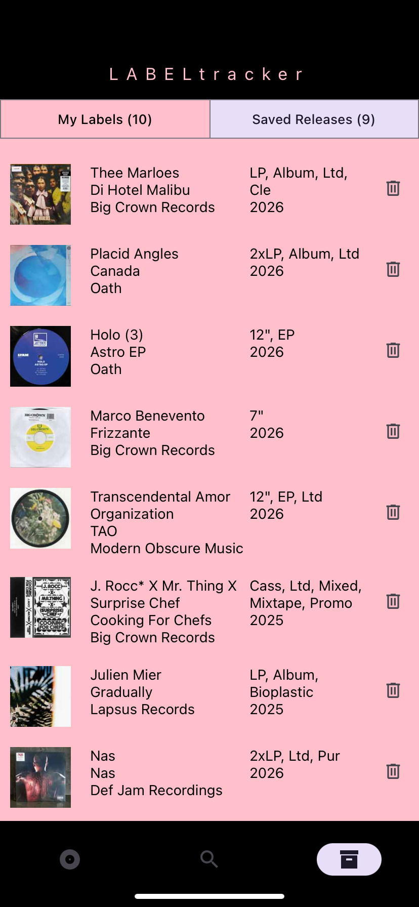
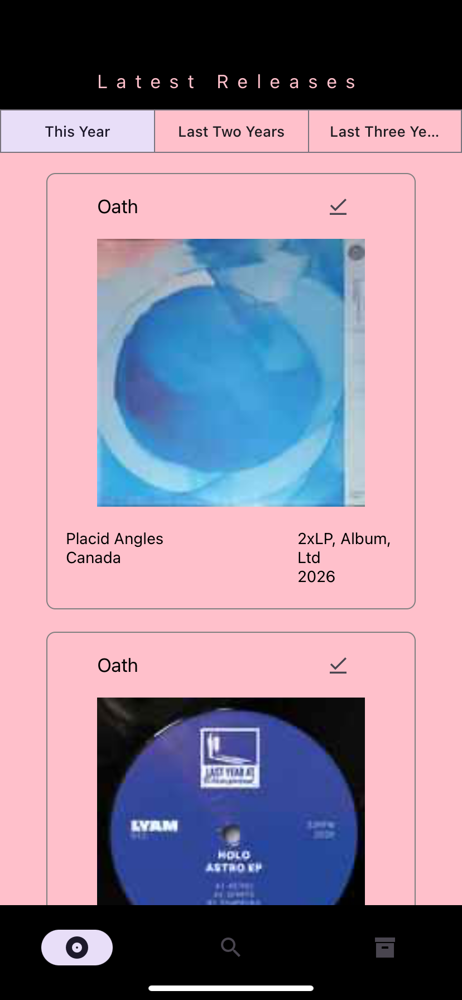
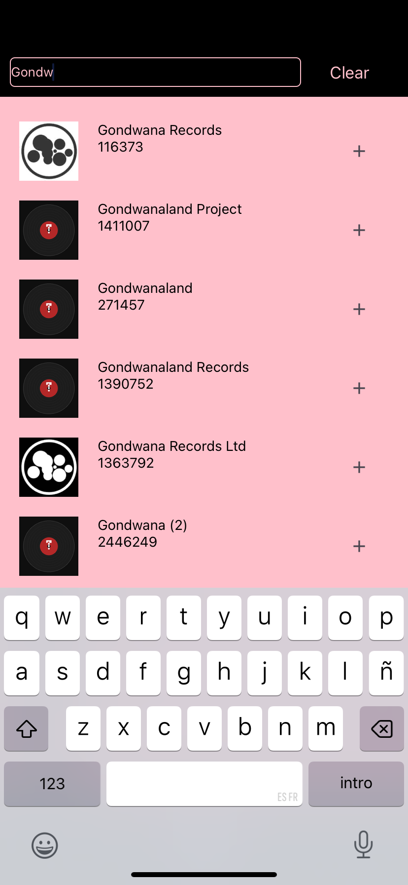
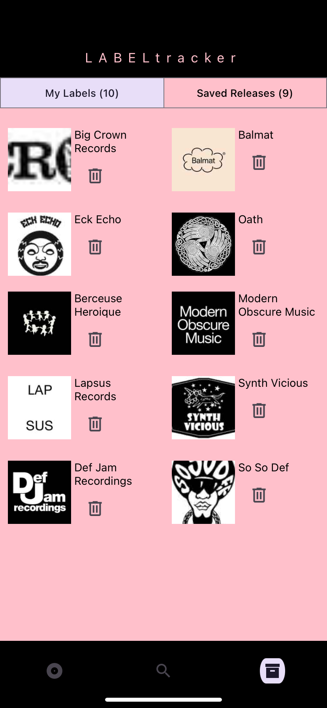

<!--
Standard README template for the mobile_app_project
Edit the sections below to match project specifics (screenshots, demo links, env values).
-->
# Mobile App Project

[](LICENSE)

A cross-platform mobile app for discovering and curating music releases via Discogs. Browse by labels, track new releases, save favorites to personal profiles, and follow feeds based on your curation preferences.



## Table of Contents
- [Features](#features)
- [Demo / Screenshots](#demo--screenshots)
- [Installation](#installation)
- [Quick Start](#quick-start)
- [Configuration](#configuration)
- [Development](#development)
- [API / Server Endpoints](#api--server-endpoints)
- [Testing](#testing)
- [Contributing](#contributing)
- [License](#license)
- [Authors](#authors)

## Features
- **Search & Browse** music releases on the Discogs database, with primary focus on labels and new releases.
- **User Profiles** with saved content and personal music curation.
- **Feeds** dynamically generated based on user preferences and followed labels.
- **Mobile-First UI** built with React Native / Expo for iOS and Android.
- **Node.js Backend** seamlessly integrating Discogs API for reliable data delivery.

## Demo / Screenshots
- 
- 
- 

## Prerequisites
- **Discogs Account & API Credentials:** You must create a free account on [Discogs.com](https://www.discogs.com/) and generate an API key and personal access token. [See Discogs API docs](https://www.discogs.com/developers/) for instructions.
- **Local Environment:** `node` (LTS), `npm` or `yarn`, optionally `expo-cli` for mobile development.

## Installation
Clone the repo and install dependencies for both client and server:

```bash
git clone <repo-url>
cd mobile_app_project

# Client
cd client
npm install

# Server
cd ../server
npm install
```

## Quick Start
Run the client and server in parallel (development mode):

```bash
# From repo root - start server
cd server
npm run dev   # or `nodemon`

# In a new terminal - start client
cd client
npx expo start     # or `npm start` 
```

Open the app on a simulator or device and ensure the server URL in the client config points to your backend (see Configuration).

## Configuration
- Client: check `client/config.js` or `config.js` for API base URL and environment flags.
- Server: use a `.env` file in `server/` for keys such as `PORT`, `DISCOGS_API_KEY`.

Example `.env` (server):

```
PORT=3000
DISCOGS_API_KEY=your_key_here
```

Example client config (client/config.js):

```js
export default {
  API_BASE_URL: 'http://localhost:3000'
}
```

## Development
This section covers tools and processes to improve code quality and speed up development:

- **Linting** (`npm run lint`): Automatically checks your code for style and logic errors, catching bugs early.
- **Formatting** (`npm run format`): Auto-formats code for consistent style across the team.
- **Hot Reload**: As you save changes, the app instantly refreshes without restarting:
  - Client: React fast refresh (Expo/React Native).
  - Server: `nodemon` watches files and auto-restarts on changes.

Suggested dev workflow:

```bash
# Start server with nodemon
cd server
npm run dev

# Start client
cd ../client
npm start
```

## API / Server Endpoints
The server exposes REST endpoints consumed by the mobile client. Below are example endpoints (check `server/routes/discogsRoute.js` for actual implementation):

- `GET /api/search?q=...` — search music releases by query.
- `GET /api/feeds` — retrieve personalized feed items (may be implemented).
- `GET /api/profile/:id` — fetch user profile data (may be implemented).

For the current state, see `server/routes/` and `server/controllers/` for the actual routes and logic implemented.

## Testing
Testing is not yet implemented in this project. If you'd like to add tests later, run:

```bash
# Server tests (when configured)
cd server
npm test

# Client tests (when configured)
cd ../client
npm test
```

This is a great next step as the project matures!

## Contributing
Please read `CONTRIBUTING.md` if present. Typical contribution flow:

1. Fork the repo
2. Create a feature branch
3. Open a PR with a clear description

Add unit tests and keep changes focused.

## Troubleshooting / FAQ
- If the client cannot reach the server, ensure `API_BASE_URL` is correct and the server `PORT` is open.
- For mobile device testing, use your machine IP (e.g., `http://192.168.x.y:3000`) instead of `localhost`.

## Roadmap
- **Deploy for Multiple Platforms:** Make the app available on iOS App Store, Google Play, and/or web.
- **User Authentication:** Secure login, account management, and personalized settings.
- **Refine Data Curation:** Improve filtering and curation of new releases to better match user preferences.
- **Streaming Integration:** Connect with Spotify, Apple Music, or Bandcamp so users can listen to saved releases directly in the app.
- **AI-Driven Recommendations:** Suggest new labels and releases based on user's curation history and saved collections.

## Changelog
- See GitHub Releases for notable changes.

## License
This project is licensed under the MIT License — see the `LICENSE` file for details.

## Authors
- Project maintained by the authors listed in the repository.

---

**Questions?** Check the [Discogs API documentation](https://www.discogs.com/developers/) or open an issue in this repository.
